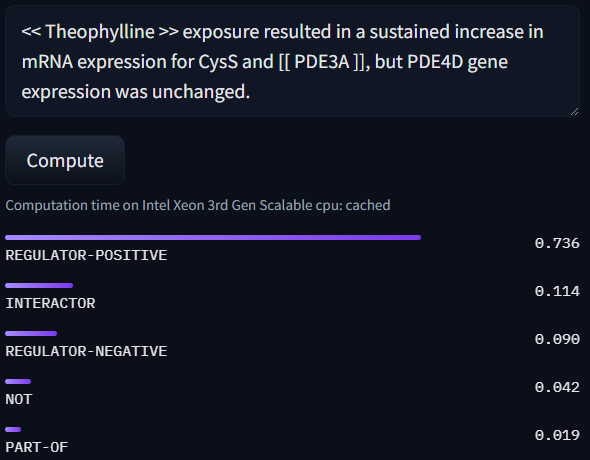
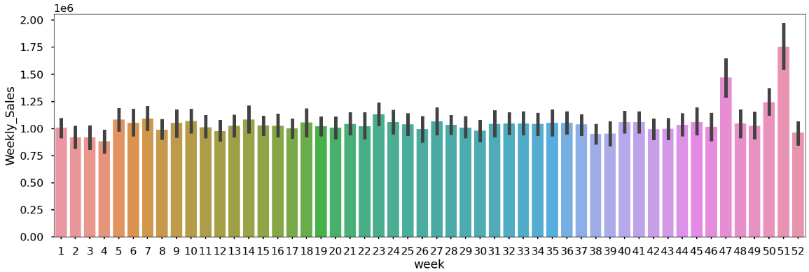

## Выполненные проекты в области машинного обучения

---

### Извлечение отношений из медицинских текстов

Проект по извлечению отношений химико-белковых взаимодействий на основе корпуса [ChemProt](https://biocreative.bioinformatics.udel.edu/news/corpora/chemprot-corpus-biocreative-vi/).

  

[View code on Colab](https://colab.research.google.com/drive/13-VrFtXREpqdQXJesNjk1XzkMgxOkro4?usp=sharing)

---

### Сравнительный анализ методов ML для определения эмоциональной окраски отзывов на фильмы на платформе КиноПоиск

Учебный проект по определению эмоциональной окраски отзывов с платформы  Кинопоиск. Был проведен сравнительный анализ методов опорных векторов, случайного леса и k-ближайших соседей.

  

<!--
  
-->
[View code on Colab](https://colab.research.google.com/drive/1Y4kKRCaeXWLQabzQIrgc0jo1RMsFzPlk?usp=sharing)

---

### Анализ данных Walmart

Учебный проект по анализу данных розничного магазина, имеющего несколько торговых точек по всей стране.

  

[View code on Colab](https://colab.research.google.com/drive/1yY3g2VDL9SQ-8y_mBP4HbzEk3a5enmgU?usp=sharing)

<!--
 ## Skills-based projects
A selection of smaller projects demonstrating specific data science and ML skills.

- [Working in the cloud: Using data stored in AWS S3 buckets](#)
- [Optimising code with multiprocessing](#)](url) 
-->

<!-- 

Page template forked from <a href="https://github.com/evanca/quick-portfolio">evanca</a>
 
-->
<!-- 
Remove above link if you don't want to attibute 
-->

<!-- 
## 👋 Welcome to my portfolio

Hello! My name is Matt, and I set up this page to showcase some of the data science projects I've been working on.

At age 18, while working as a cold caller in a telesales team at Ovo Energy, I built my first data product: a recommendation engine which predicted customers' propensity to buy. The tool helped me double my sales rate and, after I'd persuaded senior managers to take it into production, boosted our whole team's sales by 10%. 

The reason I tell this story is because I think it shows what data can and should be: a tool for empowering people and uplifting businesses. 

In the past 8 years, I've studied at two of the world's best universities and worked in a variety of industries, gaining experience in machine learning, strategy, analytics and marketing. My [CV](https://mattschapman.github.io/pdf/Matt_Chapman_CV.pdf) has plenty of information about the professional projects I've worked on, but the purpose of this page is to showcase some of my favourite personal (on-the-side) projects in a more visual way. 

If you have any questions, feel free to drop me an [email](mailto:mattchapmanmsc@gmail.com) or send me a message on [LinkedIn](https://www.linkedin.com/in/matt-chapman-ba8488118/). 

Thanks for reading,

Matt
 -->
 
<!--
### Using BERT and Naïve Bayes models for helpfulness prediction of Amazon reviews
The quality and helpfulness of online reviews can vary greatly, meaning readers must often sift through a deluge of online reviews in order to find the most relevant ones. In this project, I compared the performance of various ML models for predicting the helpfulness of an Amazon review given its text and metadata.  

    

[View code on Colab](https://colab.research.google.com/drive/19N1n117gN_qHPVd8VqqRDur5v8z0tANY?usp=sharing)
 -->
